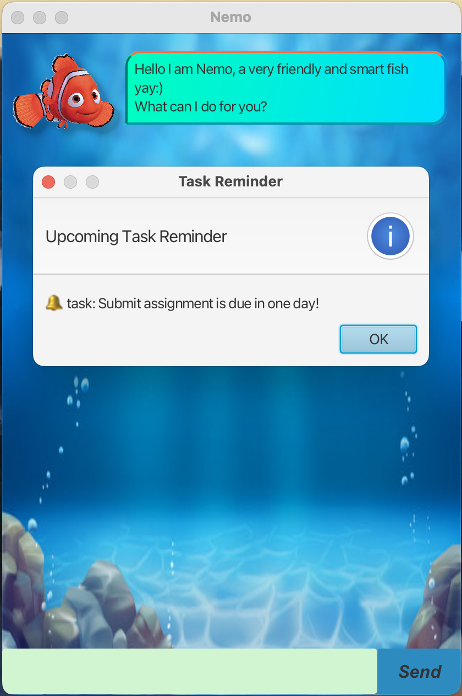
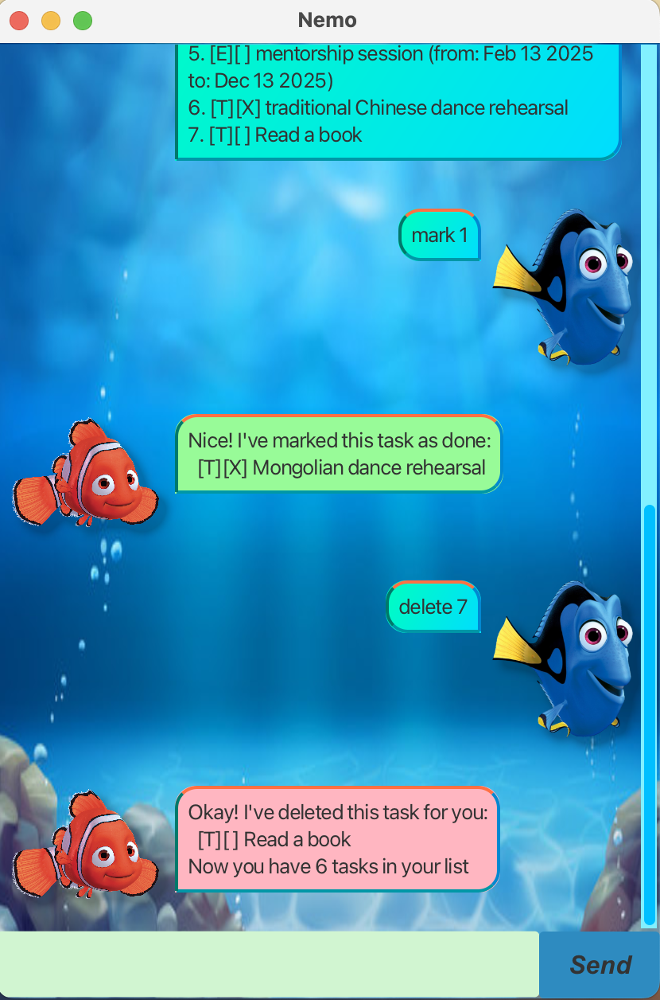

# **Nemo User Guide**

## **Introduction**
Nemo is a simple and efficient task management application designed to help users organize their tasks effectively. It supports adding, deleting, listing, and setting reminders for tasks, ensuring that nothing important is forgotten.

## **Table of Contents**
- [Getting Started](#getting-started)
- [Adding Tasks](#adding-tasks)
- [Adding Deadlines](#adding-deadlines)
- [Adding Events](#adding-events)
- [Listing Tasks](#listing-tasks)
- [Marking Tasks as Done](#marking-tasks-as-done)
- [Deleting Tasks](#deleting-tasks)
- [Setting Reminders](#setting-reminders)
- [Saving and Loading Tasks](#saving-and-loading-tasks)
- [Exiting Nemo](#exiting-nemo)
- [Sample GUI Screenshots](#sample-gui-screenshots)

---

## **Getting Started**
To launch Nemo, run the following command in the terminal:
```sh
java -jar nemo.jar
```
This starts the Nemo application and displays a welcome message.

---

## **Adding Tasks**
To add a new task, use the following command:
```sh
todo [task description]
```
**Example:**
```sh
todo Read a book
```
**Expected output:**
```
Got it! I've added this task to your list:
    [T][] Read a book
Now you have 2 tasks in your list.
```
(*The number of tasks will vary based on your task list.*)

---

## **Adding Deadlines**
To add a task with a deadline:
```sh
deadline [task description] /by [due date]
```
**Example:**
```sh
deadline Submit assignment /by 2025-02-19
```
📌 *Dates must be in the yyyy-mm-dd format.*

---

## **Adding Events**
To add an event:
```sh
event [task description] /from [start date] /to [end date]
```
**Example:**
```sh
event Mentorship session /from 2024-07-30 /to 2025-02-19
```
📌 *Dates must be in the yyyy-mm-dd format.*

---

## **Listing Tasks**
To display all tasks, use:
```sh
list
```
**Example output:**
```
1. [D][ ] Submit assignment (by: 2024-07-30)
2. [T][ ] Read a book
```

---

## **Marking Tasks as Done**
To mark a task as completed:
```sh
mark [task number]
```
**Example:**
```sh
mark 2
```
**Expected output:**
```
Nice! I've marked this task as done:
    [T][X] Read a book
```

To mark a task as *not done*:
```sh
unmark [task number]
```
**Example:**
```sh
unmark 2
```
**Expected output:**
```
Okay! I've marked this task as not done:
    [T][ ] Read a book
```

---

## **Deleting Tasks**
To remove a task from the list:
```sh
delete [task number]
```
**Example:**
```sh
delete 2
```
**Expected output:**
```
Okay! I've deleted this task for you:
    [T][ ] Read a book
Now you have 1 task in your list.
```

---

## **Setting Reminders**
Nemo will automatically notify you when a task deadline is approaching or an event is starting soon.

**Example reminder popup:**
```
🔔 Reminder: Mentorship session is starting soon!
```
*(This appears as a system alert in the GUI.)*

---

## **Saving and Loading Tasks**
- Tasks are automatically saved and loaded from `tasks.txt`.
- There is no need for manual saving—your tasks persist between sessions.

---

## **Exiting Nemo**
To exit the application:
```sh
bye
```
**Expected output:**
```
Bye! Hope to see you again soon!
```

---

## **Sample GUI Screenshots**
Here are some example screenshots of Nemo in action:  
  


---

## **Additional Notes**
✔ Tasks are stored persistently in `tasks.txt`.  
✔ Reminders will pop up as alerts when tasks are due soon.

For further assistance, refer to the official documentation or contact support.

